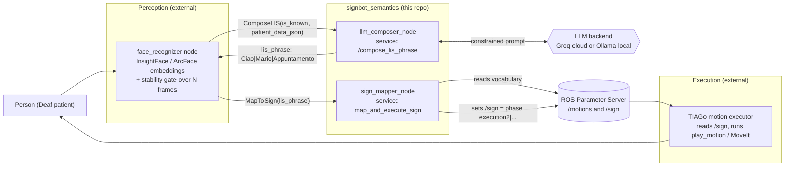

# Deafender (SignBot)

Socially aware TIAGo assistance for Deaf patients in a hospital waiting room.

A modular ROS system that recognizes a patient, retrieves their clinical context, composes a short phrase in Italian Sign Language (LIS) under strict constraints, and has a TIAGo robot physically sign it.

Elective in AI: Human Robot Interaction (HRI) and Robot Benchmarking and Competitions (RBC).
Authors: Andrea Baldi, Serena Trovalusci.

## Overview

Hospitals are busy, stressful places. For Deaf and hard of hearing patients, a waiting room that relies on spoken announcements and quick verbal exchanges can be hard to access, which affects not just information but also comfort, autonomy, and trust.

Deafender addresses this with a simulated TIAGo robot that communicates in LIS (Lingua dei Segni Italiana). While a patient waits for an appointment, the robot does four things:

1. Sees a person and recognizes whether they are a known patient or unknown.
2. Remembers: for known patients, it retrieves structured context (department, purpose of visit, priority, age, notes).
3. Reasons: it composes a short LIS phrase that fits the context, using a language model held to a closed vocabulary of signs the robot can actually perform.
4. Acts: it maps each sign to a motion primitive and executes the gestures.

The robot is a complementary assistant, not a replacement for staff. It reduces uncertainty and makes the interaction standardized and reproducible.

## What's in this repository

The Deafender system has four functional blocks. This repository contains the semantics layer (the two stages in bold below) plus the ROS service definitions they share.

| Block | Responsibility | In this repo? |
|-------|----------------|:---:|
| Social signal perception | Face detection and identity recognition (InsightFace/ArcFace), stability gating | No, separate component |
| Memory and knowledge | Patient knowledge base (semantic attributes, priority) | Sample fixtures only |
| Social reasoning and composition | Constrained LIS sentence generation via LLM | Yes, `signbot_semantics` |
| Sign mapping and dispatch | Validate signs against the motion library, dispatch the command | Yes, `signbot_semantics` |
| Gesture execution | TIAGo motion playback in Gazebo (`/play_motion`, MoveIt) | No, separate component |

So the composer and the mapper live here. The face recognition front end and the TIAGo/Gazebo motion executor are external components of the wider project, described in the report and referenced below where they connect.

## How it works: two stages

A language model is good at choosing what to say and adapting tone, but it will happily invent words. A signing robot can only perform a fixed, predefined set of motions. SignBot bridges that gap with a design that first generates, then verifies:

1. The composer is tightly constrained by its prompt to emit only signs from an allowed vocabulary, separated by the `|` character, with no extra text.
2. The mapper treats that output as untrusted. It splits the phrase, checks every sign against the live vocabulary, and substitutes a `NonCapito` ("not understood") fallback for anything invalid. Only a fully validated command reaches the robot.

This keeps the robot's behavior bounded and lets it degrade gracefully: an imperfect phrase still yields safe, runnable gestures instead of a crash or nonsense motion.

## Architecture



The vocabulary at `/motions` is the single source of truth. It is loaded once from `lis_motions.yaml` onto the ROS Parameter Server at launch, and both nodes read it from there: the composer to constrain generation, the mapper to validate.

## Repository layout

```
defender_me/
├── CMakeLists.txt                  # Catkin workspace top level
├── .gitignore
│
├── signbot_msgs/                   # Service definitions (the contract)
│   ├── srv/
│   │   ├── ComposeLIS.srv          # request a LIS phrase from the LLM
│   │   └── MapToSign.srv           # validate a phrase and command the robot
│   ├── CMakeLists.txt
│   └── package.xml
│
└── signbot_semantics/              # The semantics layer
    ├── nodes/
    │   ├── llm_composer.py          # /compose_lis_phrase service (LLM)
    │   ├── sign_mapper.py           # map_and_execute_sign service (validator)
    │   └── test_client.py           # test harness (simulates perception)
    ├── config/
    │   └── lis_motions.yaml         # the closed LIS vocabulary (source of truth)
    ├── data/
    │   ├── pazienti.csv             # sample patient records (reference)
    │   └── dizionario_segni.csv     # sample sign list (reference)
    ├── launch/
    │   └── test_semantics.launch    # loads vocabulary and starts both nodes
    ├── CMakeLists.txt
    └── package.xml
```

## The packages

### signbot_msgs: the service contract

Defines the two ROS services the rest of the system depends on. Building this package generates the Python service classes (`ComposeLIS`, `MapToSign`, and their `*Request` and `*Response` companions).

`ComposeLIS.srv` asks the LLM for a phrase:

| Direction | Field | Type | Meaning |
|-----------|-------|------|---------|
| Request | `is_known` | `bool` | `True` if the patient is recognized, `False` otherwise |
| Request | `patient_data_json` | `string` | JSON with the context (name, department, purpose, priority, age, notes) |
| Response | `lis_phrase` | `string` | LIS phrase separated by `|`, e.g. `Ciao\|Mario\|Appuntamento` |
| Response | `success` | `bool` | Whether composition succeeded |

`MapToSign.srv` validates and dispatches:

| Direction | Field | Type | Meaning |
|-----------|-------|------|---------|
| Request | `lis_phrase` | `string` | The phrase to validate (separated by `|`) |
| Response | `success` | `bool` | Whether a valid command was written to `/sign` |

### signbot_semantics: the logic

`llm_composer.py` hosts `/compose_lis_phrase`. It:

1. Deserializes `patient_data_json`.
2. Branches on `is_known`. A known patient gets a personalized message fitted to the context; an unknown patient gets generic guidance inviting them to register at reception, with no patient data accessed.
3. Pulls the allowed sign list live from `/motions` and injects it into the system prompt as a hard constraint.
4. Adapts the tone from the context (for example a high priority oncology visit, or an irritated or confused expression, leads to calmer, more reassuring signs).
5. Calls the configured LLM backend and returns the phrase. On any failure it returns a safe fallback.

`sign_mapper.py` hosts `map_and_execute_sign`. It:

1. Loads the valid sign set from `/motions`.
2. Splits the phrase on `|`, trims whitespace, and validates each sign.
3. Replaces any unknown sign with the `NonCapito` fallback (and fails cleanly only if even the fallback is undefined).
4. Joins the validated signs, prepends the executor command prefix `phase execution2|`, and writes the result to the `/sign` parameter. This is the handoff point to TIAGo's motion executor. The mapper does not compute joint trajectories itself; it only returns `success` and writes the symbolic command.

`test_client.py` is a standalone harness that simulates the upstream perception node. It runs a known patient scenario and an unknown patient scenario, chaining composer to mapper and logging each step.

## The LIS vocabulary and motion library

`config/lis_motions.yaml` defines the closed vocabulary under a top level `motions` key. Each key is a sign name (the token the LLM must use) mapping to the motion file the executor plays:

```yaml
motions:
  "Ciao":         { file: 'saluto_ciao.yaml' }
  "Appuntamento": { file: 'info_appuntamento.yaml' }
  "Dottore":      { file: 'ruolo_dottore.yaml' }
  "NonCapito":    { file: 'comprensione_noncapito.yaml' }   # the fallback sign
  # ...
```

Each referenced `*.yaml` motion file (on the executor side, not in this repo) holds the joint trajectories, timing, and metadata for one sign. Because both nodes read this vocabulary through the Parameter Server, adding a sign is a single line edit here plus authoring the motion file. No code changes are needed.

The `NonCapito` key must always exist; the mapper relies on it as its safety net. The vocabulary is fully configurable: the deployed demo used signs such as `Coraggio`, `Pediatrici`, `Visita`, `Controllo`, `Rassicurante`, `Invita`, and `Segreteria` alongside the base set.

## The patient knowledge base

For known users, the system reasons over an explicit, inspectable record (the report uses a JSON knowledge base; this repo ships CSV sample fixtures in `data/`). Biometric identity is kept separate from this record: face recognition only establishes who the person is, while all context comes from the knowledge base. This is a deliberate, privacy aware separation.

Representative entries:

| Name | Age | Department | Purpose | Priority | Notes |
|------|----:|------------|---------|----------|-------|
| Sofia Vartolo | 32 | Gynecology | Routine check up | Normal | Prefers concise explanations |
| Iside Veneziano | 70 | Oncology | Chemotherapy | High | May appreciate a slower pace, extra confirmation |
| Lorenzo Taddei | 15 | Pediatrics | Sprained ankle, X-ray check | Normal | May appreciate a slower pace, extra confirmation |

The `priority` field lets the robot tell routine cases from urgent ones and adapt its communication.

## Requirements

- ROS Noetic (catkin), Ubuntu 20.04. The package layout and Python 3 nodes target Noetic.
- Python 3 with `rospy` and `requests`.
- An LLM backend, one of:
  - Groq (cloud, used in the final system): `pip install groq`, model `llama-3.1-8b-instant`.
  - Ollama (local) running `llama3:8b`.
- Full system only, not needed for the semantics layer:
  - the EMPOWER Docker image `registry.gitlab.com/brienza1/empower_docker:latest` on top of a TIAGo `tiago_public_ws`.
  - TIAGo simulation in Gazebo, the face recognition node (InsightFace), and the companion workspace packages `signbot_bringup`, `execution`, and `tiago_face_recognition`.

## Build

Place both packages in a catkin workspace `src/` and build. `signbot_msgs` must build before `signbot_semantics`, since the latter depends on the generated services; catkin resolves this automatically.

```bash
cd ~/catkin_ws
catkin_make                 # or: catkin build
source devel/setup.bash

# make the node scripts executable (first time only)
chmod +x src/signbot_semantics/nodes/*.py
```

## Configuration

The composer selects its backend from the `LLM_MODE` environment variable.

Cloud (Groq), recommended and used in the final system:

```bash
export LLM_MODE=CLOUD
export GROQ_API_KEY="your_key_here"
pip install groq
```

Why Groq? Both backends were evaluated during development. Local `llama3:8b` via Ollama was workable but varied in output stability and in obeying the strict lexical constraints. Groq's `llama-3.1-8b-instant` gave more stable, lower latency results under tight constraints, which matters for interactive use.

Local (Ollama):

```bash
export LLM_MODE=OLLAMA        # default if unset
ollama pull llama3:8b
```

The node expects Ollama at `http://host.docker.internal:11434` (that host implies running inside a container talking to Ollama on the host).

Keep secrets out of git. `.env` and `.bashrc.local` are already in `.gitignore`.

## Run

### A. Semantics layer only (no robot)

For developing or testing the composer and mapper without simulation, launch the vocabulary load plus both service nodes, then drive them with the test client:

```bash
roscore &                              # if not already running
roslaunch signbot_semantics test_semantics.launch

# in another sourced terminal:
rosrun signbot_semantics test_client.py

# inspect the final command the robot would receive:
rosparam get /sign
# e.g. phase execution2|Ciao|Mario|Appuntamento|Dottore
```

### B. Full system in simulation (TIAGo and Gazebo, Dockerized)

The complete Deafender system runs inside the EMPOWER Docker image (`registry.gitlab.com/brienza1/empower_docker:latest`) on top of a TIAGo `tiago_public_ws`. Orchestration lives in a separate `signbot_bringup` package whose `signbot_system.launch` brings up everything at once.

Before you start, set your credentials and never commit them:

```bash
export GROQ_API_KEY="<your-groq-key>"     # do NOT hard code this anywhere
export LLM_MODE=CLOUD                      # use Groq; set OLLAMA for the local backend
```

Put these in `~/.bashrc` inside the container so every new terminal inherits them.

Recommended: the "Ultimate Pipeline" (single command bringup):

```bash
# Terminal 1: full system
xhost +
sudo docker start -ai <container_id>
source ~/.bashrc
roslaunch signbot_bringup signbot_system.launch

# Terminal 2: robot camera view
xhost +
sudo docker exec -it <container_id> /bin/bash
source ~/.bashrc
rosrun rqt_image_view rqt_image_view

# Terminal 3: drive the robot with the keyboard arrows
xhost +
sudo docker exec -it <container_id> /bin/bash
source ~/.bashrc
rosrun key_teleop key_teleop.py
```

`signbot_system.launch` starts the Gazebo world, the motion executor, face recognition, and the SignBot semantics nodes together. Use Terminal 2 to watch the camera feed (face box and identity label) and Terminal 3 to move TIAGo toward a patient.

Manual bringup (one component per terminal), useful for debugging. The lines `xhost +`, then `sudo docker exec -it <container_id> /bin/bash`, then `source ~/.bashrc` apply to every terminal below:

```bash
# Terminal 1: Gazebo world
# Office:
roslaunch tiago_gazebo tiago_gazebo.launch public_sim:=true end_effector:=pal-hey5 \
          world:=simple_office_with_people
# Hospital:
roslaunch tiago_gazebo tiago_gazebo.launch public_sim:=true end_effector:=pal-hey5 \
          world:=my_hospital

# Terminal 2: motion executor and LLM composer
rosparam load .../execution/resources/lis_motions.yaml /motions   # vocabulary into /motions
rosrun execution run_play_motion __ns:=/motions                    # listens on /sign
rosrun signbot_semantics llm_composer.py                           # the composer node

# Terminal 3: face recognition
roslaunch tiago_face_recognition recognition.launch image:=/xtion/rgb/image_raw

# Terminal 4: camera view
rosrun rqt_image_view rqt_image_view
```

Handy extras:

```bash
# Manually fire a sign sequence (bypasses the LLM, good for testing the executor):
rosparam set /sign "phase execution2|Grazie"

# Raise TIAGo's torso and tilt the head down so it sees standing patients:
rostopic pub -1 /torso_controller/command trajectory_msgs/JointTrajectory \
  "{joint_names: ['torso_lift_joint'], points: [{positions: [0.25], time_from_start: {secs: 2}}]}"
rostopic pub -1 /head_controller/command trajectory_msgs/JointTrajectory \
  "{joint_names: ['head_1_joint','head_2_joint'], points: [{positions: [0.0, 0.6], time_from_start: {secs: 2}}]}"

# Inspect recognition output:
rostopic echo /face_recognizer/identities
```

Useful topics and parameters:

| Name | Kind | Role |
|------|------|------|
| `/xtion/rgb/image_raw` | topic | TIAGo RGB camera input |
| `/face_recognizer/identities` | topic | recognized identities and info |
| `/face_recognizer/image_with_detections` | topic | annotated camera frame (view in rqt) |
| `/motions` | param | the closed LIS vocabulary (loaded from `lis_motions.yaml`) |
| `/sign` | param | command to the executor, e.g. `phase execution2|Ciao|Grazie` |

A note on packages: this repository ships `signbot_msgs` and `signbot_semantics`. The full pipeline above also relies on `signbot_bringup` (launch orchestration), `execution` (`run_play_motion` plus the motion `*.yaml` files for each sign), and `tiago_face_recognition`. These live in the wider `tiago_public_ws` and EMPOWER workspace, not here. Note also that `lis_motions.yaml` exists both in `signbot_semantics/config/` and in the `execution` package's `resources/`; the executor loads its copy into the `/motions` namespace, which the semantics nodes then read.

## Example flows (from the live system)

Known patient, Lorenzo Taddei (15, Pediatrics):

```
face_recognizer  ->  /compose_lis_phrase
   is_known=True  data={age:15, department:'Pediatrics',
                        purpose:'Sprained ankle, X-ray check',
                        priority:'normal', name:'Lorenzo_Taddei', ...}
LLM_COMPOSER (Mode: CLOUD)
   ->  Ciao|Lorenzo_Taddei|Coraggio|Pediatrici|Visita|Controllo   (success=True)
sign_mapper
   ->  /sign = phase execution2|Ciao|Lorenzo_Taddei|Coraggio|Pediatrici|Visita|Controllo
TIAGo executor  ->  plays each gesture (MoveIt, RRTConnect)
```

The phrase carries patient specific information and a reassuring tone (`Coraggio`) for a young patient, while staying inside the closed vocabulary.

Unknown patient:

```
face_recognizer  ->  classified UNKNOWN (no patient data accessed)
LLM_COMPOSER     ->  Ciao|Rassicurante|Invita|Segreteria   (success=True)
sign_mapper      ->  /sign = phase execution2|Ciao|Rassicurante|Invita|Segreteria
TIAGo executor   ->  "Gesto da eseguire: Ciao", then plans and plays gestures
```

A neutral, polite invitation to register, with no personalization and no assumptions.

If the model ever emits a token outside the vocabulary, the mapper swaps just that token for `NonCapito` and still produces a safe, runnable command.

## Design principles (HRI and RBC)

The project is framed through two lenses, and the architecture reflects both.

Human Robot Interaction: socially appropriate behavior, personalization, and robustness. A stability gate requires the same identity across several consecutive frames before the robot acts, which avoids erratic or repeated triggering. Tone and content adapt to the user (calmer for elderly, high priority, or pediatric cases). Known and unknown users get distinct, predictable strategies.

Robot Benchmarking and Competitions: a clean separation of perception, reasoning, and execution so each module can be benchmarked on its own (recognition stability, sentence validity and vocabulary compliance, execution success), with task level scenarios that allow partial success. Configuration is external (YAML motions, structured patient data) for reproducibility.

A user study with Deaf participants is designed in the report (research questions, hypotheses, counterbalanced protocol) to evaluate perceived clarity and social appropriateness, though it was not run within the project's scope.

## A note on the data files

`data/pazienti.csv` and `data/dizionario_segni.csv` are sample fixtures. At runtime, patient context is passed as JSON (`patient_data_json`) and the authoritative sign list comes from `lis_motions.yaml` through the Parameter Server, so the composer does not read these CSVs directly (a `get_patient_data` placeholder remains for structure). They are kept as a starting point for a patient knowledge base.

## Extending it

- Add a sign: add an entry under `motions:` in `lis_motions.yaml` and provide its motion file on the executor side. Both nodes pick it up automatically.
- Swap the model: change `GROQ_MODEL` or `OLLAMA_MODEL` near the top of `llm_composer.py`.
- Change the executor handshake: the output contract is the `/sign` parameter and the `phase execution2|` prefix in `sign_mapper.py`.
- Tune behavior: the persona, the LIS constraints, and the tone rules live in the `SYSTEM_PROMPT`, `VINCOLI_LIS`, and `GUIDA_COMPORTAMENTALE` strings in the composer.

## Future work

From the report: expand the LIS motion library and smooth the transitions between signs; richer perception and world or uncertainty modeling; affective perception (emotion recognition) for more empathetic adaptation; hybrid symbolic and data driven reasoning with dialog state and long term memory; real user studies with Deaf participants; and privacy preserving identity recognition.

## Citation

A. Baldi and S. Trovalusci. Deafender: Socially Aware TIAGo Assistance for Deaf Patients in a Hospital Waiting Room. Elective in AI report (HRI and RBC).

Key methods build on ArcFace face embeddings (Deng et al., CVPR 2019) and the LLaMA model family (Touvron et al., 2023), with design inspiration from socially assistive robotics and semantic grounding frameworks (for example EMPOWER and KnowRob). See the report's references for the full list.

## License and maintainers

The `package.xml` manifests currently declare `license: TODO` with a placeholder maintainer. Update these before any public release. This is an academic course project by Andrea Baldi and Serena Trovalusci; add the intended license and contact details here.
